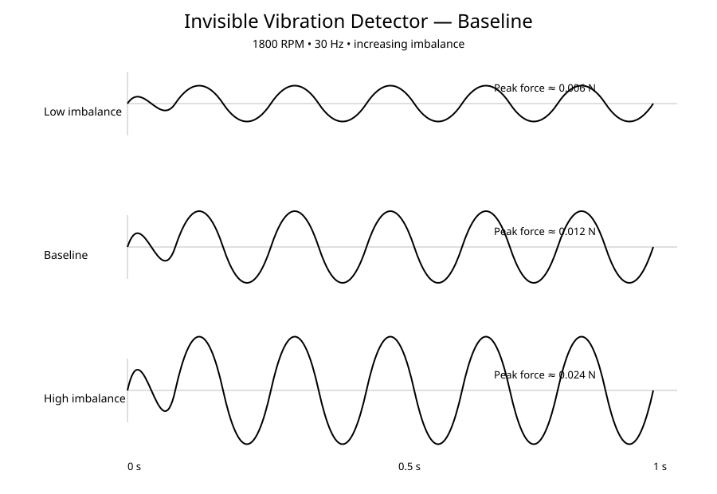

# Project 01 — Invisible Vibration Detector

## Question

Can a small rotating imbalance be detected from vibration data?

## What this project does

This project simulates the radial force produced by an off-center rotating mass.

It compares three imbalance levels at the same rotation speed:

- Low imbalance
- Baseline imbalance
- High imbalance

The simulation checks peak vibration force and dominant vibration frequency.

## Result

At the same rotation speed, increasing the imbalance increases the vibration amplitude while the main vibration frequency remains tied to the rotation speed.

This is the first baseline experiment. The signal is ideal and contains no measurement noise.

## Next step

Add noise and background vibration, then test whether the imbalance can still be detected.
